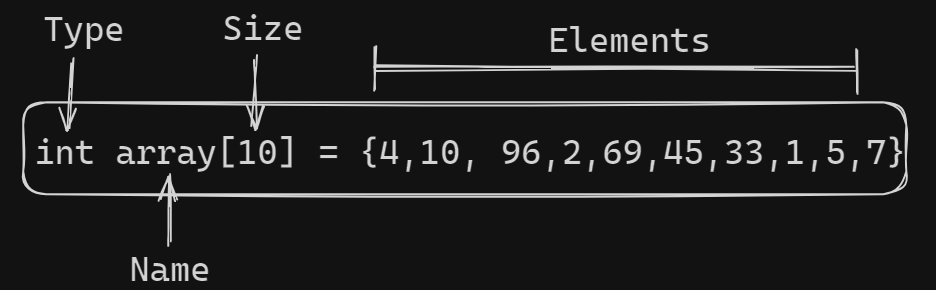
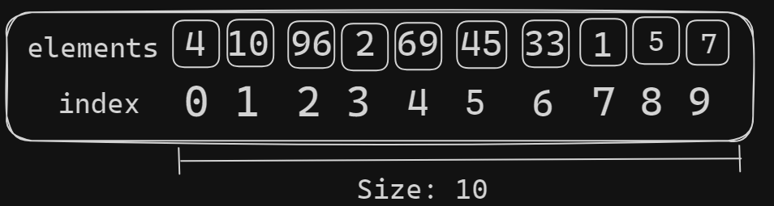

## Contributing

Contributions are always welcome!

See `contributing.md` for ways to get started.

Please adhere to this project's `code of conduct`.

# Data Structure and Algorithms in C

Data Structure and Algorithms (DSA) is a specific way to store and organize data in a computer memroy so that these data can be used in effeciently later. The data may be arranged in many different ways such as the logical or mathematical model for a particular organization of data is termed as data structure.

### The variety of a particular

The variety of a particular data model depends on the two factors -
 Firstly, it must be loaded enough in structure to reflect the actual relationships of
the data with the real world object.

 Secondly, the formation should be simple enough so that anyone can efficiently
process the data each time it is necessary.

## Categories of Data Structure

The data structure can be sub divided into major types:
| Type | Description | Examples |
:------- | :------------------------- | ---------- |
`Linear Data Structure` | A data structure is said to be linear if its elements combine to form any specific order. | Arrays, Queues , Stacks, etc
`Non-Linear Data Structure` | This structure is mostly used for representing data that contains a hierarchical relationship among various elements. | Graphs, Family trees, table of content, etc |

## Linear Data Structure

A data structure is said to be linear if its elements combine to form any specific order.
There are basically two techniques of representing such linear structure within memory.

 First way is to provide the linear relationships among all the elements
represented by means of linear memory location. These linear structures are termed as
arrays.

 The second technique is to provide the linear relationship among all the elements
represented by using the concept of pointers or links. These linear structures are
termed as linked lists.
The common examples of linear data structure are:
Arrays
 Queues
 Stacks
 Linked lists

## Non Linear Data Structure

This structure is mostly used for representing data that contains a hierarchical
relationship among various elements.
Examples of Non Linear Data Structures are listed below:
 Graphs
 Family of trees and
 Table of contents

### Tree

In this case, data often contain a hierarchical relationship among various
elements. The data structure that reflects this relationship is termed as rooted tree
graph or a tree.

### Graph

In this case, data sometimes hold a relationship between the pairs of elements
which is not necessarily following the hierarchical structure. Such data structure is
termed as a Graph.

### Array

Array is a container which can hold a fix number of items and these items should be of
the same type. Most of the data structures make use of arrays to implement their
algorithms. Following are the important terms to understand the concept of Array.

 **Element** − Each item stored in an array is called an element.
 **Index** − Each location of an element in an array has a numerical index, which is used to identify the element.

## Array Representation: (storage structure)

Declaration of Array can be done by the following way -

```
    Syntax : Data_type  array_name  [Array_size] ;
```




As per above illustration, following are the important points to be considered.

- Index starts with 0.
- Array length is 10 which means it can store 10 elements.
- Each element can be accessed via it's index.  
```
Note: 1st element is present at the 0th index, 2nd element is present at the 1st index, and so on.
```

  #### for example

  ```c
  printf(index[8]);
  ```

    #### output : 1
    As from above example, we can see that the  value at index 8 is '1'. 

      ## Basic Opertions
      Following are the basic operations supported by an array.

- Traverse - print all the array elements one by one.
- Insertion - Adds an element at the given index.
- Deletion - Deletes an element at the given index.
- Searching - Search for an element using the given index or by the value.
- Update - Updates an element at the given index.

## Data types

In C, when an array is initialized with size, then it assigns defaults values to its
elements in following order.

| Data Types | Default value |
| :--------- | :------------ |
| `bool`     | false         |
| `int`      | 0             |
| `float`    | 0             |
| `double`   | 0.01          |
| `void  `   | NULL          |
| `char `    | 0             |
| `wchar_t`  | 0             |

### Insertion Operation

    Insert operation is to insert one or more data elements into an array. Based on the

requirement, a new element can be added at the beginning, end, or any given index of array.

Here, we see a practical implementation of insertion operation, where we add data at the end of the array −

#### Algorithm

Let **LA** be a Linear Array (unordered) with N elements and **K** is a positive integer such
that **K<=N**. Following is the algorithm where ITEM is inserted into the Kth position of LA

```
1. Start
2. Set J = N
3. Set N = N + 1
4. Repeat steps 5 and 6 while J >= K
5. Set LA[J+1] = LA[J]
6. Set J = J-1
7. Set LA[K] = ITEM
8. Stop
```

### Example

Following is the implementation of the above algorithm −

```c
#include <stdio.h>

main() {
 int LA[] = {1,3,5,7,8};
 int item = 10, k = 3, n = 5;
 int i = 0, j = n;
 printf("The original array elements are :\n");
 for(i = 0; i<n; i++) {
    printf("LA[%d] = %d \n", i, LA[i]);
 }
 n = n + 1;
 while( j >= k) {
    LA[j+1] = LA[j];
    j = j - 1;
 }
 LA[k] = item;
 printf("The array elements after insertion :\n");
 for(i = 0; i<n; i++) {
    printf("LA[%d] = %d \n", i, LA[i]);
 }
}
```

When we compile and execute the above program, it produces the following result −

#### Output

```
The original array elements are :
LA[0] = 1
LA[1] = 3
LA[2] = 5
LA[3] = 7
LA[4] = 8


The array elements after insertion :
LA[0] = 1
LA[1] = 3
LA[2] = 5
LA[3] = 10
LA[4] = 7
LA[5] = 8

```

## Deletion Operation

In deletion operation, we remove an element from the sorted array and re-organize all elements of an array.

### Algorithm

Consider LA is a linear array with N elements and K is a positive integer such
that K<=N. Following is the algorithm to delete an element available at the Kth position
of LA.

```
1. Start
2. Set J = K
3. Repeat steps 4 and 5 while J < N
4. Set LA[J] = LA[J + 1]
5. Set J = J+1
6. Set N = N
7. Stop
```

#### Example

Following is the implementation of the above algorithm −

```c
#include <stdio.h>

void main() {
   int LA[] = {1,3,5,7,8};
   int k = 3, n = 5;
   int i, j;
     printf("The original array elements are :\n");
   for(i = 0; i<n; i++) {
      printf("LA[%d] = %d \n", i, LA[i]);
   }

   j = k;
   while( j < n) {
      LA[j-1] = LA[j];
      j = j + 1;
   }
   n = n -1;
     printf("The array elements after deletion :\n");
   for(i = 0; i<n; i++) {
      printf("LA[%d] = %d \n", i, LA[i]);
   }
}
```

When we compile and execute the above program, it produces the following result −

#### Output

```
The original array elements are :
LA[0] = 1
LA[1] = 3
LA[2] = 5
LA[3] = 7
LA[4] = 8
The array elements after deletion :
LA[0] = 1
LA[1] = 3
LA[2] = 7
LA[3] = 8
```

### Search Oeprtaion

We can perform a search for an array element based on its value or its index.

#### Algorithm

Consider LA is a linear array with N elements and K is a positive integer such
that K<=N. Following is the algorithm to find an element with a value of ITEM using
sequential search.

```
1. Start
2. Set J = 0
3. Repeat steps 4 and 5 while J < N
4. IF LA[J] is equal ITEM THEN GOTO STEP 6
5. Set J = J +1
6. PRINT J, ITEM
7. Stop
```

#### Example

Following is the implementation of the above algorithm −

```c
#include <stdio.h>

void main() {
   int LA[] = {1,3,5,7,8};
   int item = 5, n = 5;
   int i = 0, j = 0;
      printf("The original array elements are :\n");
    for(i = 0; i<n; i++) {
      printf("LA[%d] = %d \n", i, LA[i]);
   }
     while( j < n){
      if( LA[j] == item ) {
         break;
      }
     j = j + 1;
   }
  printf("Found element %d at position %d\n", item, j+1);
}
```

When we compile and execute the above program, it produces the following result −

#### Output

```
The original array elements are :
LA[0] = 1
LA[1] = 3
LA[2] = 5
LA[3] = 7
LA[4] = 8
Found element 5 at position 3
```

In this example, `item` is 5 and `N` is 5. The search starts from index 0 in the array `LA`.

### Update Operation

Update operation refers to updating an existing element from the array at a given index.

#### Algorithm

Consider LA is a linear array with N elements and K is a positive integer such
that K<=N. Following is the algorithm to update an element available at the Kth position
of LA.

```
1. Start
2. Set LA[K-1] = ITEM
3. Stop
```

#### Example

Following is the implementation of the above algorithm −
#include <stdio.h>

```c
void main() {
  int LA[] = {1,3,5,7,8};
  int k = 3, n = 5, item = 10;
  int i, j;
    printf("The original array elements are :\n");
  for(i = 0; i<n; i++) {
     printf("LA[%d] = %d \n", i, LA[i]);
  }

  LA[k-1] = item;
 printf("The array elements after updation :\n");
  for(i = 0; i<n; i++) {
     printf("LA[%d] = %d \n", i, LA[i]);
  }
}
```

When we compile and execute the above program, it produces the following result −

#### Output

```
The original array elements are :
LA[0] = 1
LA[1] = 3
LA[2] = 5
LA[3] = 7
LA[4] = 8
The array elements after updation :
LA[0] = 1
LA[1] = 3
LA[2] = 10
LA[3] = 7
LA[4] = 8
```

## LINKED LIST

A linked list is a sequence of data structures, which are connected together via links.
Linked List is a sequence of links which contains items. Each link contains a connection
to another link. Linked list is the second most-used data structure after array. Following
are the important terms to understand the concept of Linked List.

- Link − Each link of a linked list can store a data called an element.
- Next − Each link of a linked list contains a link to the next link called Next.
- LinkedList − A Linked List contains the connection link to the first link called first.

### Linked List Representation
Linked list can be visualized as a chain of nodes, where every node points to the next 
node. 

As per the above illustration, following are the important points to be considered. 
+ Linked List contains a link element called first. 
+ Each link carries a data field(s) and a link field called next. 
+ Each link is linked with its next link using its next link. 
+ Last link carries a link as null to mark the end of the list. 

### Types of Linked List 
Following are the various types of linked list. 
+ Simple Linked List − Item navigation is forward only. 
+ Doubly Linked List − Items can be navigated forward and backward. 
+ Circular Linked List − Last item contains link of the first element as next and 
the first element has a link to the last element as previous.

#### Basic Operations 
Following are the basic operations supported by a list. 
+ Insertion − Adds an element at the beginning of the list. 
+ Deletion − Deletes an element at the beginning of the list. 
+ Display − Displays the complete list. 
+ Search − Searches an element using the given key. 
+ Delete − Deletes an element using the given key.


## Binary Tree
A binary tree consists of a finite set of nodes that is either empty, or consists of one 
specially designated node called the root of the binary tree, and the elements of two 
disjoint binary trees called the left subtree and right subtree of the root. 
Note that the definition above is recursive: we have defined a binary tree in terms of 
binary trees. This is appropriate since recursion is an innate characteristic of tree 
structures.

### Binary Tree Terminology
Tree terminology is generally derived from the terminology of family trees (specifically, 
the type of family tree called a lineal chart). 
+ Each root is said to be the parent of the roots of its subtrees. 
+ Two nodes with the same parent are said to be siblings; they are the children of 
their parent. 
+ The root node has no parent. 
+ A great deal of tree processing takes advantage of the relationship between a 
parent and its children, and we commonly say a directed edge (or simply 
an edge) extends from a parent to its children. Thus edges connect a root with 
the roots of each subtree. An undirected edge extends in both directions between 
a parent and a child.
+ Grandparent and grandchild relations can be defined in a similar manner; we 
could also extend this terminology further if we wished (designating nodes as 
cousins, as an uncle or aunt, etc.)

### Other Tree Terms 
   The number of subtrees of a node is called the degree of the node. In a binary 
tree, all nodes have degree 0, 1, or 2. 
+ A node of degree zero is called a terminal node or leaf node. 
+ A non-leaf node is often called a branch node. 
+ The degree of a tree is the maximum degree of a node in the tree. A binary tree 
is degree 2. 
+ A directed path from node n1 to nk is defined as a sequence of nodes n1, n2, 
..., nk such that ni is the parent of ni+1 for 1 <= i < k. An undirected path is a 
similar sequence of undirected edges. The length of this path is the number of 
edges on the path, namely k – 1 (i.e., the number of nodes – 1). There is a path 
of length zero from every node to itself. Notice that in a binary tree there is 
exactly one path from the root to each node. 
+ The level or depth of a node with respect to a tree is defined recursively: the level 
of the root is zero; and the level of any other node is one higher than that of its 
parent. Or to put it another way, the level or depth of a node ni is the length of the 
unique path from the root to ni. 
+ The height of ni is the length of the longest path from ni to a leaf. Thus all leaves 
in the tree are at height 0. 
+ The height of a tree is equal to the height of the root. The depth of a tree is equal 
to the level or depth of the deepest leaf; this is always equal to the height of the 
tree. 
+ If there is a directed path from n1 to n2, then n1 is an ancestor of n2 and n2 is a 
descendant of n1. 

### Special Forms of Binary Trees 
There are a few special forms of binary tree worth mentioning. 
If every non-leaf node in a binary tree has nonempty left and right subtrees, the tree is 
termed a strictly binary tree. Or, to put it another way, all of the nodes in a strictly binary 
tree are of degree zero or two, never degree one. A strictly binary tree with N leaves 
always contains 2N – 1 nodes. 

Some texts call this a "full" binary tree. 
A complete binary tree of depth d is the strictly binary tree all of whose leaves are at 
level d. 

The total number of nodes in a complete binary tree of depth d equals 2d+1 – 1. Since all 
leaves in such a tree are at level d, the tree contains 2d leaves and, therefore, 2d - 1 
internal nodes.